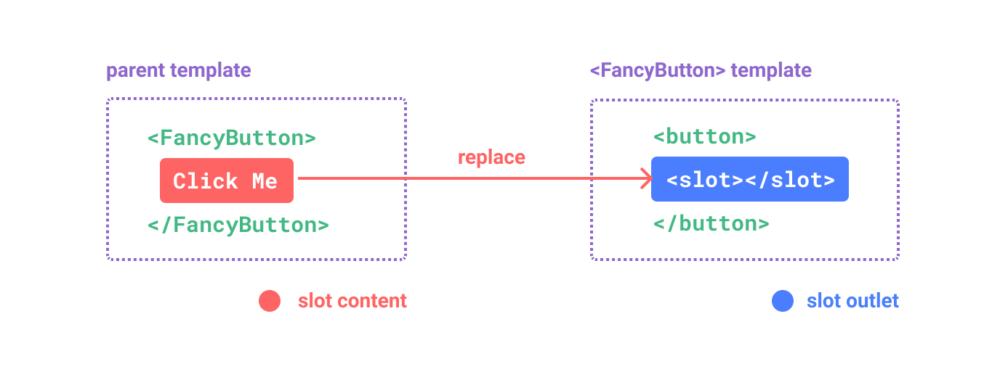
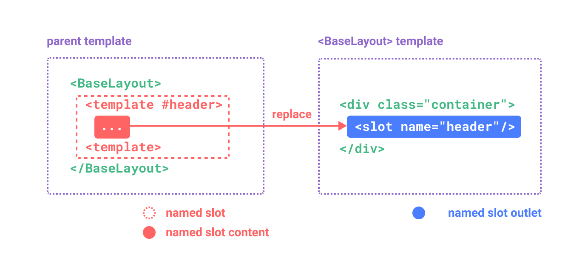
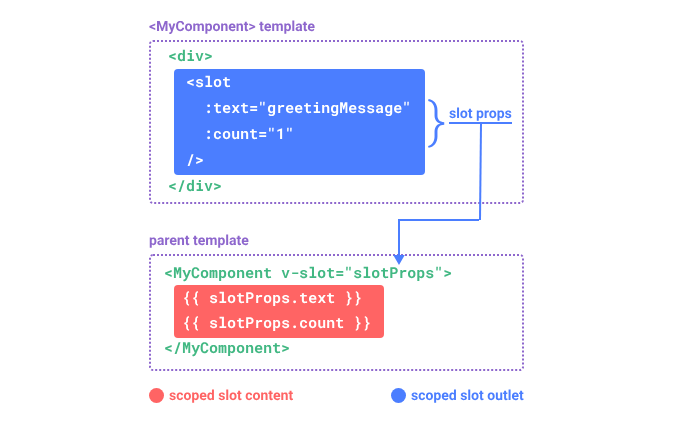

# Vue3-知识速记

## 一.创建应用

### 1.创建

- createApp：创建应用，实际就是创建根组件。
- mount 挂载，应用实例必须在调用了.mount 方法后才能渲染出来。该方法接收一个“容器”参数，可以是一个实际的 DOM 元素或是一个 CSS 选择器字符串。
- 应用根组件的内容将会被渲染在容器元素里面。容器元素自己将不会被视为应用的一部分。（也就是说 App 会被渲染到<div id="app"></div>容器里面，但是容器自身不会被视为应用的一部分）。
- mount()方法应该始终在整个应用配置和资源注册完成后被调用。
- createApp 返回值是应用实例，mount 返回值是根组件实例。

```javascript
// html
// <div id="app"></div>
// js
createApp(App).mount("#app");
```

### 2.配置

应用实例会暴露一个 .config 对象允许我们配置一些应用级的选项。

```javascript
//应用配置
//配置错误处理器
app.config.errorHandler = (err) => {};
//全局组件注册
app.component;
//全局属性注册
app.config.globalProperties;
//使用插件
app.use();
//全局自定义指令
app.directive;
//全局的依赖注入
app.provide;
app.config;
//3.mount挂载
app.mount("#app");
```

### 3.多应用实例

应用实例并不只限于一个。createApp API 允许你在同一个页面中创建多个共存的 Vue 应用，而且每个应用都拥有自己的用于配置和全局资源的作用域。

## 二.模版语法

2.1 文本插值
它使用的是“Mustache”语法 (即双大括号)。 双大括号不能在 HTML attributes 中使用。

```javascript
<span>Message: {{ msg }}</span>。
```

2.2 原始 Html
v-html 指令， 在当前组件实例上，将此元素的 innerHTML 与 rawHtml 属性保持同步。

```javascript
<p>
  Using v-html directive: <span v-html="rawHtml"></span>
</p>
```

2.3 Attribute 绑定
使用 v-bind 指令。v-bind 指令指示 Vue 将元素的 id attribute 与组件的 dynamicId 属性保持一致。如果绑定的值是 null 或者 undefined，那么该 attribute 将会从渲染的元素上移除。

```javascript
<div v-bind:id="dynamicId"></div>
```

- 简写形式 v-bind:id => :id

```javascript
<div :id="dynamicId"></div>
```

- 同名简写(>3.4)：如果 attribute 的名称与绑定的 JavaScript 值的名称相同，那么可以进一步简化语法，省略 attribute 值。

- 布尔 Attribute：依据 true / false 值来决定 attribute 是否应该存在于该元素上。disabled 就是最常见的例子之一。

```javascript
<button :disabled="isButtonDisabled">Button</button>
```

    当 isButtonDisabled 为真值或一个空字符串 (即 <button disabled="">) 时，元素会包含这个 disabled attribute。而当其为其他假值时 attribute 将被忽略。

- 动态绑定多个值

  如果你有像这样的一个包含多个 attribute 的 JavaScript 对象，通过不带参数的 v-bind，你可以将它们绑定到单个元素上。

```javascript
//js
const objectOfAttrs = {
  id: 'container',
  class: 'wrapper',
  style: 'background-color:green'
}
//template
<div v-bind="objectOfAttrs"></div>
```

2.4 使用 Javascript 表达式

    Vue 实际上在所有的数据绑定中都支持完整的 JavaScript 表达式。JavaScript 表达式可以被使用在如下场景上：

- 在文本插值中 (双大括号)
- 在任何 Vue 指令 (以 v- 开头的特殊 attribute) attribute 的值中
- 每个绑定仅支持单一表达式，也就是一段能够被求值的 JavaScript 代码。一个简单的判断方法是是否可以合法地写在 return 后面。
- 支持调用函数。
- 受限的全局访问：模板中的表达式将被沙盒化，仅能够访问到有限的全局对象列表。

  2.5 指令 Directives

  指令是带有 v- 前缀的特殊 attribute。指令 attribute 的期望值为一个 JavaScript 表达式 (除了少数几个例外，即之后要讨论到的 v-for、v-on 和 v-slot)。一个指令的任务是在其表达式的值变化时响应式地更新 DOM。

- 参数 Arguments：某些指令会需要一个“参数”，在指令名后通过一个冒号隔开做标识

```javascript
<a v-bind:href="url"> ... </a>

<!-- 简写 -->
<a :href="url"> ... </a>
```

这里 href 就是一个参数，它告诉 v-bind 指令将表达式 url 的值绑定到元素的 href attribute 上。在简写中，参数前的一切 (例如 v-bind:) 都会被缩略为一个 : 字符。

- 动态参数

同样在指令参数上也可以使用一个 JavaScript 表达式，需要包含在一对方括号内：

```javascript

// 注意，参数表达式有一些约束，
<a v-bind:[attributeName]="url"> ... </a>

<!-- 简写 -->
<a :[attributeName]="url"> ... </a>
```

这里的 attributeName 会作为一个 JavaScript 表达式被动态执行，计算得到的值会被用作最终的参数。举例来说，如果你的组件实例有一个数据属性 attributeName，其值为 "href"，那么这个绑定就等价于 v-bind:href。

    动态参数值的限制：
    动态参数中表达式的值应当是一个字符串，或者是 null。特殊值 null 意为显式移除该绑定。其他非字符串的值会触发警告。

    动态参数语法的限制：
    动态参数表达式因为某些字符的缘故有一些语法限制，比如空格和引号，在 HTML attribute 名称中都是不合法的。

- 修饰符 Modifiers
  修饰符是以点开头的特殊后缀，表明指令需要以一些特殊的方式被绑定。例如 .prevent 修饰符会告知 v-on 指令对触发的事件调用 event.preventDefault()。

```javascript
<form @submit.prevent="onSubmit">...</form>
```


2.6 setup

- `<script setup>` 解放双手。
- setup() 函数中需要手动暴露大量的状态和方法非常繁琐

## 三. 响应式基础

### 1. 声明响应式状态

- ref

  - 接收基本类型和对象。
  - ref() 接收参数，并将其包裹在一个带有 .value 属性的 ref 对象中返回。
  - 模版中可以直接使用声明的变量，Script 中需使用.value 进行拆包。
  - ref 会根据初始值推导类型，也可以使用 Ref 这个类型，或者使用泛型。

- reactive 对象，不用拆包，默认深层响应。

## 十五.Props

### 15.1 props 声明与响应式结构

在 `<script setup>` 中使用 defineProps()宏来声明。

- 使用数组+字符串

```javascript
defineProps(["title"]);
```

- 使用对象形式
  key 是 prop 的名称，value 是 prop 预期类型的构造函数。
  - type：

```javascript
defineProps({
  name: String,
});
```

### 15.2 props 传递

静态和动态传递，propName.:propName。
如果你想要将一个对象的所有属性都当作 props 传入，你可以使用没有参数的 v-bind，即只使用 v-bind 而非 :prop-name，v-bind="对象"，实际等价于拆解的：propName。

### 15.3 单向数据流

从父组件流向子组件，不可逆向。子组件不应该修改 Props。

- 一般要修改 Props 的两个场景：
  - prop 被用于传入初始值；而子组件想在之后将其作为一个局部数据属性。在这种情况下，最好是新定义一个局部数据属性，从 props 上获取初始值即可。
  - 需要对传入的 prop 值做进一步的转换。在这种情况中，最好是基于该 prop 值定义一个计算属性。
    Tips：如果 Props 是对象/数组类型的话，Vue 没法限制，所以修改的话是会影响父组件的。

### 15.4 props 校验

向 defineProps() 宏提供一个带有 props 校验选项的对象。
参数说明：

- type：类型
- require：是否是可选的，默认是必传的。
- default：默认值
- validator：参数校验函数

注意事项：

- 所有 prop 默认都是可选的，除非声明了 required: true。
- 除 Boolean 外的未传递的可选 prop 将会有一个默认值 undefined。
- Boolean 类型的未传递 prop 将被转换为 false。这可以通过为它设置 default 来更改——例如：设置为 default: undefined 将与非布尔类型的 prop 的行为保持一致。
- 如果声明了 default 值，那么在 prop 的值被解析为 undefined 时，无论 prop 是未被传递还是显式指明的 undefined，都会改为 default 值。
- 当 prop 的校验失败后，Vue 会抛出一个控制台警告 (在开发模式下)。
- 如果 type 仅为 null 而非使用数组语法，它将允许任何类型。

```javascript
defineProps({
  name: {
    type: String,
    default: "",
    require: false,
    //校验函数,当 prop 的校验失败后，Vue 会抛出一个控制台警告 (在开发模式下)。
    validator(value, props) {
      return ["success", "warning", "danger"].includes(value);
    },
  },
  // 对象类型的默认值
  propF: {
    type: Object,
    // 对象或数组的默认值
    // 必须从一个工厂函数返回。
    // 该函数接收组件所接收到的原始 prop 作为参数。
    default(rawProps) {
      return { message: "hello" };
    },
  },
  // 函数类型的默认值
  propH: {
    type: Function,
    // 不像对象或数组的默认，这不是一个
    // 工厂函数。这会是一个用来作为默认值的函数
    default() {
      return "Default function";
    },
  },
});
```

## 16 组件事件

与原生 Dom 事件不同，组件触发的事件没有冒泡机制。你只能监听直接子组件触发的事件。

声明事件
使用 defineEmits 宏来进行声明，参数可以是数组，也可以是对象。对象可以指定参数的类型和进行校验。
选项式使用 emits 选项来声明。

触发
在组件模版表达式中使用$emit来进行触发，例如$emit('someEvent')。在父组件中使用@some-event 来监听（@为 v-on 简写）。
在`<script setup>`触发，使用 宏声明以后返回的函数进行触发。

参数与校验
参数直接跟在事件名后即可。

```javascript
//在模版中
<button @click="$emit('some',1)">Add </button>
//在<scrip setup>中
// defineEmits(['some'])
const emit=defineEmits({
    someEvent(params:{name:string}){
        //对参数进行校验
        return true
    },
    emit:()=>{
        //对参数进行校验
        return true
    }
})
//发送事件
emit('some')
```

## 17 v-model

知识点：选项式，组合式使用，v-model 参数，一个组件多 v-model 绑定，v-model 修饰符。

双向绑定实质是子组件声明一个属性和事件，然后父组件声明一个响应状态并把这个作为参数传递给子组件，同时监听子组件这个事件。父子都可以修改这个属性，并且能够感知到最新值。
不同的是子组件是通过发送事件给父组件，让父组件进行修改的。

### 17.1 基本用法

组合式 在`<script setup>`中
默认 v-model：这种方式父组件可以直接使用 v-model，也就是没有参数。

```javascript
//Parent
 <Child v-model="msg" />
//Child
const model=defineModel()
<input v-model="model">
```

选项式

```javascript
//Parent
<Child v-model="msg"/>
//本质上
<Child :modelValue="msg" @update:model-value="(value)=>{msg=value}"/>

//Child 名称固定，不可更改
props(['modelValue'])
emits(['update:modelValue'])
<input :value="modelValue" @input="$emit('update:modelValue',$event.target.value)"
```

### 17.2 v-model 参数

可以指定名称，在一个组件上使用多了 v-model。

```javascript
//Parent
 <Child v-model="msg" />
//Child
const title=defineModel('title')
<input v-model="title">
```

选项式

```javascript
//Parent
<Child v-model:title="msg"/>
//本质上
<Child :title="msg" @update:title="(value)=>{msg=value}"/>

//Child
props(['title'])
emits(['update:title'])
<input :value="title" @input="$emit('update:title',$event.target.value)"
```

### 17.3 v-model 修饰符

组合式

```javascript
//Parent
 <Child v-model.xxx="myText" />
//Child
const [title,modifers]=defineModel('title',{
   set(value){
      if(modifers.xxx){
         return value
      }
      return value
   }
})
<input v-model="title">
```

选项式

```javascript
//Parent
 <Child v-model.xxx="myText" />

//Child
props({
  title: String,
  titleModifiers: {
   default: () => ({})
   }
})
emits(['update:title'])
<input :value="title" @input="$emit('update:title',$event.target.value)"
```

## 18 透传 attribute

传递给一个组件但是却没有被该组件声明为 props/emits 的 attribute 或 v-on 事件监听器。最常见的例子是：class,style,id。

- Attribute 继承
  class，style
  默认会透传到该组件的根元素上，如果已经存在了，那么会和根组件上的 class 或者 stlye 合并。

- v-on 事件监听器继承
  也适用上面的规则。
  click 监听器会被添加到 子组件的根元素，即那个原生的 `<button>` 元素之上。当原生的 `<button>` 被点击，会触发父组件的 onClick 方法。同样的，如果原生 button 元素自身也通过 v-on 绑定了一个事件监听器，则这个监听器和从父组件继承的监听器都会被触发。

- 禁用 Attribute 继承
  禁止以后，可以手动控制如何使用，在模版中可以使用$attrs来获取。
这个 $attrs 对象包含了除组件所声明的 props 和 emits 之外的所有其他 attribute，例如 class，style，v-on 监听器等等。
通过v-bind="$attrs" 来实现。
  Tips：
  和 props 有所不同，透传 attributes 在 JavaScript 中保留了它们原始的大小写，所以像 foo-bar 这样的一个 attribute 需要通过 $attrs['foo-bar'] 来访问。
  像 @click 这样的一个 v-on 事件监听器将在此对象下被暴露为一个函数 $attrs.onClick。

```javascript
defineOptions({
    inheritAttrs:false
})

<button :class="$attrs.class">Add</button>
```

- 多根节点的 Attributes 继承
  和单根节点组件有所不同，有着多个根节点的组件没有自动 attribute 透传行为。如果 $attrs 没有被显式绑定，将会抛出一个运行时警告。
  如果 $attrs 被显式绑定，则不会有警告。

- 在 JavaScript 中访问 attrs
  这里的 attrs 对象总是反映为最新的透传 attribute，但它并不是响应式的 (考虑到性能因素)。你不能通过侦听器去监听它的变化。如果你需要响应性，可以使用 prop。或者你也可以使用 onUpdated() 使得在每次更新时结合最新的 attrs 执行副作用。

```javascript
const attrs = useAttrs();
console.log(attrs.class);
```

## 19 插槽

知识点：插槽内容与出口，渲染作用域，默认内容，具名插槽，条件插槽，动态插槽名，作用域插槽。

- 插槽内容与出口


- 渲染作用域
- 默认内容
- 具名插槽
  一个组件中有多个插槽的场景。
  带 name 的插槽被称为具名插槽 (named slots)。没有提供 name 的 `<slot>` 出口会隐式地命名为“default”。

  默认插槽
  v-slot:default,#default
  也可以不指定名称，当一个组件同时接收默认插槽和具名插槽时，所有位于顶级的非 `<template>` 节点都被隐式地视为默认插槽的内容。

```javascript
//声明具名插槽
//Child
<slot name="header"></slot>
//使用具名插槽 简写形式#header,v-slot对应简写为#

<Child>
<template v-slot:header> 
   
 <!-- header 插槽的内容放这里 -->
</template>
</Child>
```

- 条件插槽
   使用 $slots 属性与 v-if 来实现。v-if="$slots.header"
- 动态插槽名
```javascript
<base-layout>
  <template v-slot:[dynamicSlotName]>
    ...
  </template>

  <!-- 缩写为 -->
  <template #[dynamicSlotName]>
    ...
  </template>
</base-layout>
```
- 作用域插槽


## 20 依赖注入
解决跨级传递问题。
知识点：Prop 逐级透传问题，Provide (提供)，应用层 Provide，Inject (注入)，和响应式数据配合使用使用，Symbol作注入名。

- provide
   provide() 函数接收两个参数。
      第一个参数被称为注入名，可以是字符串或Symbol。后代组件会用注入名来查找期望注入的值。一个组件可以多次调用 provide()，使用不同的注入名，注入不同的依赖值。
      第二个参数是提供的值，值可以是任意类型，包括响应式的状态。
   支持在App层面提供依赖
   在应用级别提供的数据在该应用内的所有组件中都可以注入。

- inject
   injdect(注入名，默认值，bool)。第三个参数表示默认值是否应该被当作一个工厂函数。
   如果提供的值是一个 ref，注入进来的会是该 ref 对象，而不会自动解包为其内部的值。这使得注入方组件能够通过 ref 对象保持了和供给方的响应性链接。
   默认情况下，inject 假设传入的注入名会被某个祖先链上的组件提供。如果该注入名的确没有任何组件提供，则会抛出一个运行时警告。
   如果在注入一个值时不要求必须有提供者，那么我们应该声明一个默认值，和 props 类似。 
- 和响应式数据配合使用使用
   当提供 / 注入响应式的数据时，建议尽可能将任何对响应式状态的变更都保持在供给方组件中。
   如果在注入方组件中更改数据。在这种情况下，推荐在供给方组件内声明并提供一个更改数据的方法函数。
- Symbol作注入名
   建议最好使用 Symbol 来作为注入名以避免潜在的冲突。推荐在一个单独的文件中导出这些注入名 Symbol。