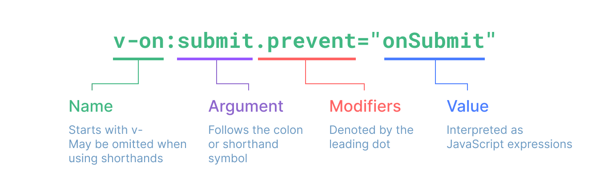

# Vue3-知识速记

## 一.创建应用

### 1.创建

- createApp：创建应用，实际就是创建根组件。
- mount挂载，应用实例必须在调用了.mount方法后才能渲染出来。该方法接收一个“容器”参数，可以是一个实际的 DOM 元素或是一个 CSS 选择器字符串。
- 应用根组件的内容将会被渲染在容器元素里面。容器元素自己将不会被视为应用的一部分。（也就是说App会被渲染到<div id="app"></div>容器里面，但是容器自身不会被视为应用的一部分）。
- mount()方法应该始终在整个应用配置和资源注册完成后被调用。
- createApp返回值是应用实例，mount返回值是根组件实例。

```javascript
// html
// <div id="app"></div>
// js
createApp(App).mount('#app')
```

### 2.配置

应用实例会暴露一个 .config 对象允许我们配置一些应用级的选项。

```javascript
//应用配置
//配置错误处理器
app.config.errorHandler=(err)=>{

}
//全局组件注册
app.component
//全局属性注册
app.config.globalProperties
//使用插件
app.use()
//全局自定义指令
app.directive
//全局的依赖注入
app.provide
app.config
//3.mount挂载
app.mount('#app')
```

### 3.多应用实例

应用实例并不只限于一个。createApp API 允许你在同一个页面中创建多个共存的 Vue 应用，而且每个应用都拥有自己的用于配置和全局资源的作用域。

## 二.模版语法

 2.1 文本插值
 它使用的是“Mustache”语法 (即双大括号)。 双大括号不能在 HTML attributes 中使用。

```javascript
<span>Message: {{ msg }}</span>。
```

 2.2 原始Html
 v-html指令， 在当前组件实例上，将此元素的 innerHTML 与 rawHtml 属性保持同步。

 ```javascript
 <p>Using v-html directive: <span v-html="rawHtml"></span></p>
 ```

 2.3 Attribute绑定
 使用v-bind指令。v-bind 指令指示 Vue 将元素的 id attribute 与组件的dynamicId 属性保持一致。如果绑定的值是 null 或者 undefined，那么该 attribute 将会从渲染的元素上移除。

 ```javascript
 <div v-bind:id="dynamicId"></div>
 ```

 - 简写形式 v-bind:id => :id

 ```javascript
 <div :id="dynamicId"></div>
 ```

 - 同名简写(>3.4)：如果 attribute 的名称与绑定的 JavaScript 值的名称相同，那么可以进一步简化语法，省略 attribute 值。

 - 布尔Attribute：依据 true / false 值来决定 attribute 是否应该存在于该元素上。disabled 就是最常见的例子之一。

```javascript
<button :disabled="isButtonDisabled">Button</button>
```

    当 isButtonDisabled 为真值或一个空字符串 (即 <button disabled="">) 时，元素会包含这个 disabled attribute。而当其为其他假值时 attribute 将被忽略。

 - 动态绑定多个值

    如果你有像这样的一个包含多个 attribute 的 JavaScript 对象，通过不带参数的 v-bind，你可以将它们绑定到单个元素上。
```javascript
//js
const objectOfAttrs = {
  id: 'container',
  class: 'wrapper',
  style: 'background-color:green'
}
//template 
<div v-bind="objectOfAttrs"></div>
```

 2.4 使用Javascript表达式

    Vue 实际上在所有的数据绑定中都支持完整的 JavaScript 表达式。JavaScript 表达式可以被使用在如下场景上：
    
 - 在文本插值中 (双大括号)
 - 在任何 Vue 指令 (以 v- 开头的特殊 attribute) attribute 的值中
 - 每个绑定仅支持单一表达式，也就是一段能够被求值的 JavaScript 代码。一个简单的判断方法是是否可以合法地写在 return 后面。
 - 支持调用函数。
 - 受限的全局访问：模板中的表达式将被沙盒化，仅能够访问到有限的全局对象列表。

 2.5 指令 Directives

    指令是带有 v- 前缀的特殊 attribute。指令 attribute 的期望值为一个 JavaScript 表达式 (除了少数几个例外，即之后要讨论到的 v-for、v-on 和 v-slot)。一个指令的任务是在其表达式的值变化时响应式地更新 DOM。
 - 参数Arguments：某些指令会需要一个“参数”，在指令名后通过一个冒号隔开做标识
    
```javascript
<a v-bind:href="url"> ... </a>

<!-- 简写 -->
<a :href="url"> ... </a>
```

这里 href 就是一个参数，它告诉 v-bind 指令将表达式 url 的值绑定到元素的 href attribute 上。在简写中，参数前的一切 (例如 v-bind:) 都会被缩略为一个 : 字符。

- 动态参数

同样在指令参数上也可以使用一个 JavaScript 表达式，需要包含在一对方括号内：

```javascript

// 注意，参数表达式有一些约束，
<a v-bind:[attributeName]="url"> ... </a>

<!-- 简写 -->
<a :[attributeName]="url"> ... </a>
```

这里的 attributeName 会作为一个 JavaScript 表达式被动态执行，计算得到的值会被用作最终的参数。举例来说，如果你的组件实例有一个数据属性 attributeName，其值为 "href"，那么这个绑定就等价于 v-bind:href。

    动态参数值的限制：
    动态参数中表达式的值应当是一个字符串，或者是 null。特殊值 null 意为显式移除该绑定。其他非字符串的值会触发警告。

    动态参数语法的限制：    
    动态参数表达式因为某些字符的缘故有一些语法限制，比如空格和引号，在 HTML attribute 名称中都是不合法的。  

- 修饰符 Modifiers
修饰符是以点开头的特殊后缀，表明指令需要以一些特殊的方式被绑定。例如 .prevent 修饰符会告知 v-on 指令对触发的事件调用 event.preventDefault()。
```javascript
<form @submit.prevent="onSubmit">...</form>
```


2.6 setup

- `<script setup>` 解放双手。
- setup()    函数中需要手动暴露大量的状态和方法非常繁琐

## 三. 响应式基础

### 1. 声明响应式状态

- ref 

   - 接收基本类型和对象。
   - ref() 接收参数，并将其包裹在一个带有 .value 属性的 ref 对象中返回。
   - 模版中可以直接使用声明的变量，Script中需使用.value进行拆包，默认浅层响应。
   - ref会根据初始值推导类型，也可以使用Ref这个类型，或者使用泛型。


- reactive 对象，不用拆包，默认深层响应。